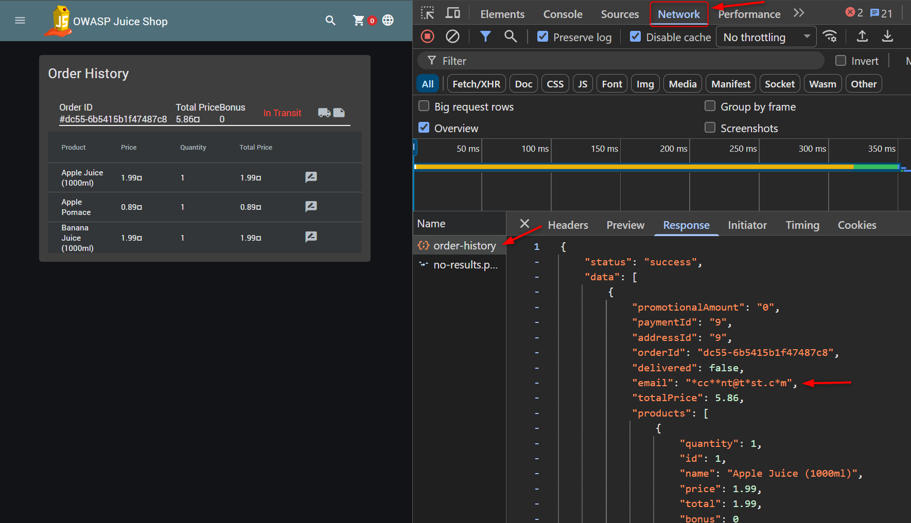

# GDPR Data Theft

## Objective

Demonstrate a **`Sensitive Data Exposure`** vulnerability by accessing another user's personal order information.

## Table of Contents

* [Quickstart](#quickstart)
* [Solution](#solution)
* [Security Impact](#security-impact)
* [Conclusion](#conclusion)

## Quickstart

* Set up OWASP Juice Shop and start it locally (see [OWASP Juice Shop Setup](../OWASP%20Juice%20Shop%20Setup/OWASP_juice_shop_setup))

## Solution

### Create the First User

Register a new account with the following email address:

```text
account@test.com
```

Log in and purchase any product.

Complete the checkout process by providing all required information, including:

* Delivery address
* Payment information
* Order confirmation

The goal is to create at least one completed order.

### Export the User Data

* Navigate to: `Account -> Privacy & Security -> Request Data Export`
* Complete the CAPTCHA.
* Select **JSON** as the export format and click **Request**.
* Open the JSON file.

Notice that it contains personal information together with the user's order history.

This indicates that the backend performs an additional request to retrieve the user's orders.

### Find and analyze the Order History API Request

* Open the browser Developer Tools by pressing `F12` on Windows/Linux or ⌥ `Option + ⌘ Command + I` on macOS.

* Navigate in the browser to: `Account → Orders & Payment → Order History`

* In Developer Tools, open the **Network** tab, locate the request named: `order-history`

* Open the **Response** tab and inspect the returned JSON.

You can see that the email address is partially masked. All vowels are replaced with `*`.

Example response: 



This suggests that the backend may use the masked email when searching for order information.

### Create a Similar User

* Register another account with a similar email address.

* Instead of: **`account@test.com`** use:  **`accaunt@test.com`**. The only difference is one changed vowel.

* Log in as the new user.

* Again, navigate to: `Account -> Privacy & Security -> Request Data Export`

* Complete the CAPTCHA and request a JSON data export.

### Verify the Result

* Inspect the exported JSON file.

* The export contains an order that the currently authenticated user has never placed.

This demonstrates that the application incorrectly associates order data with users whose masked email addresses match.

## Security Impact

An attacker could retrieve order information belonging to another user without authorization.

This may expose:

* Order history
* Purchased products
* Personal information
* Other sensitive customer data

The issue occurs because the backend does not uniquely identify users when retrieving order information.

## Conclusion

The application relies on a masked version of the user's email address when retrieving order data. Since different email addresses can produce the same masked representation, one user can receive another user's order information in the exported data.

This is an example of **`Sensitive Data Exposure`** where personal information is disclosed to an unauthorized user. This represents a GDPR-related privacy issue.