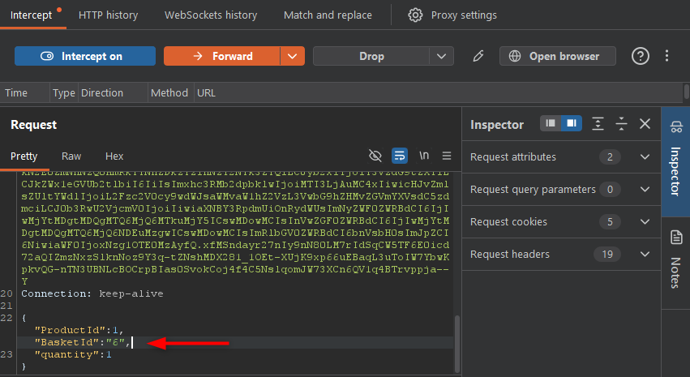
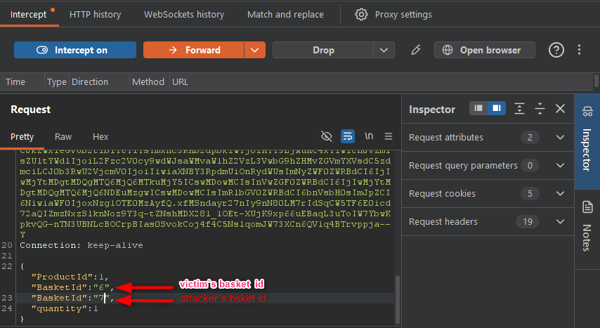

# Manipulate Basket

## Objective

Demonstrate a **`Broken Access Control`** vulnerability by manipulating a request to add a product to another user's basket without proper authorization.

## Table of Contents

- [Quickstart](#quickstart)
- [Solution](#solution)
- [Security Impact](#security-impact)
- [Conclusion](#conclusion)

## Quickstart

* Set up OWASP Juice Shop and start it locally (see [OWASP Juice Shop Setup](../OWASP%20Juice%20Shop%20Setup/OWASP_juice_shop_setup))
* Configure Burp Suite as an interception proxy (see [Burp Suite Setup](https://portswigger.net/burp/documentation/desktop/tools/proxy))

## Solution

### Prepare Two User Accounts

* Create two user accounts in OWASP Juice Shop.
* Log in as User A (target) in a regular browser session.
* Log in as User B (attacker) in a separate incognito/private session.

This allowed both users to stay logged in simultaneously.

## Identify the Target Basket
* Add a product to the basket while logged in as User A
* Capture the legitimate request in Burp Suite

Example request:

* The basket ID belonging to User A was identified (See the highlighted area in the screenshot above).
* Disable interception in Burp Suite so that subsequent requests are processed without interruption.

## Manipulate the Request to Modify Another User's Basket
* After identifying User A's basket ID, switch to User B's session and intercept a product addition request.
* Capture the legitimate request in Burp Suite
* Add another `BasketId` field to the JSON payload containing the target user's basket ID. Keep the basket ID of the currently authenticated user unchanged.
* Disable interception in Burp Suite so that subsequent requests are processed without interruption.

Example manipulated payload:

The intercepted request was modified before forwarding it to the server.

### Verify the Result
Navigate to User A's account and check the basket.

* User A's basket contains the product even though User A never added it.
* The action was performed without proper authorization checks.
* The application accepted a request that affected another user's basket.

## Security Impact
An attacker could:

* Add products to another user's basket.
* Modify another user's shopping experience.
* Potentially interfere with purchases or business processes.
* Exploit weak authorization controls to access or modify resources belonging to other users.

## Conclusion

The vulnerability exists because the application does not properly enforce ownership validation for basket operations. By tampering with request parameters, it was possible to modify resources belonging to another user.

This test demonstrates a **`Broken Access Control`** vulnerability in which insufficient server-side authorization checks allow attackers to manipulate resources belonging to other users.